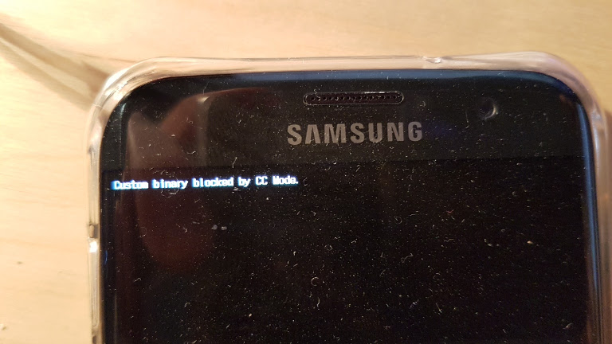

# AndroidPhone clear CC mode flag



Notes on editing the libSecurity library....

| Instruction  | Codes |
| ------------- | ------------- |
| NOP | 00 00 a0 e1 |
| branch | ad re ss EA |

Changes log for **lib32.libSecurityManagerNative.so**

| address  | change To |
| ------------- | ------------- |
| 54f0  | branch 551c, 09 00 00 EA |
| 5708  | NOP |
| 5714  | Branch 5740, 09 00 00 EA |
| 5974  | branch 59a0, 09 00 00 EA |
| 6014  | Branch 6030, 05 00 00 EA |

**logcat now shows.....** when executing unlock (code in repository)
```
--------- beginning of main
04-20 12:50:57.649  3201  3201 I FIPS_bssl: FIPS approved mode (1) | 3201 | ./unlock
04-20 12:50:57.649  3201  3201 D SecurityManager: SecurityManagerNative v1.2.5.3 On 32bit PLATFORM With BORINGSSL
04-20 12:50:57.649  3201  3201 I UNLOCK  : Unlock code started
04-20 12:50:57.649  3201  3201 I UNLOCK  : About to call setCCModeFlag
04-20 12:50:57.649  3201  3201 I UNLOCK  : setCCModeFlag = 0xf70630d0
04-20 12:50:57.649  3201  3201 E FRIGATE_BIRD: Error : Connect Failed
04-20 12:50:57.649  3201  3201 E FRIGATE_BIRD: Error : Socket fail : No such file or directory
04-20 12:50:57.649  3201  3201 E FRIGATE_BIRD: Client Fail!
04-20 12:50:57.649  3201  3201 E FRIGATE_BIRD: Error : Failed when executing command
04-20 12:50:57.649  3201  3201 D SecurityManager: Failed to read_from_secBlock. res : -1
04-20 12:50:57.649  3201  3201 I UNLOCK  : Result of setCCModeFlag -128
04-20 12:50:57.649  3201  3201 I UNLOCK  : #----
```

problem is that __"/dev/socket/frigate"__ is not found.

```
$ cd AndroidPhone/
$ cd G935/
$ sudo grep -Rn frigate .
[sudo] password for dad:
./AP_G935FXXU1BPJG_CL9519568_QB11325558_REV00_user_low_ship/boot/ramdisk/file_contexts:1752:/dev/socket/frigate		u:object_r:frigate_socket:s0
./AP_G935FXXU1BPJG_CL9519568_QB11325558_REV00_user_low_ship/boot/ramdisk/init.rc:1310:    socket frigate stream 0660 system system
./AP_G935FXXU1BPJG_CL9519568_QB11325558_REV00_user_low_ship/recovery/ramdisk/file_contexts:1752:/dev/socket/frigate		u:object_r:frigate_socket:s0
```

Next Step

- Run __init__ so that it sets up the phone completely with frigate in /dev/socket
- the line __socket frigate stream 0660 system system__ is found in __init.rc__
- The [code for the parser](https://android.googlesource.com/platform/system/core/+/69ab6de33319c111a6b9ff4c78474d7605b28175/init/init_parser.c)